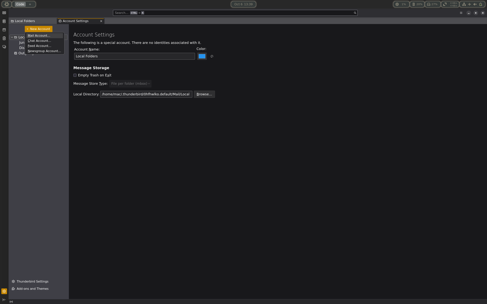
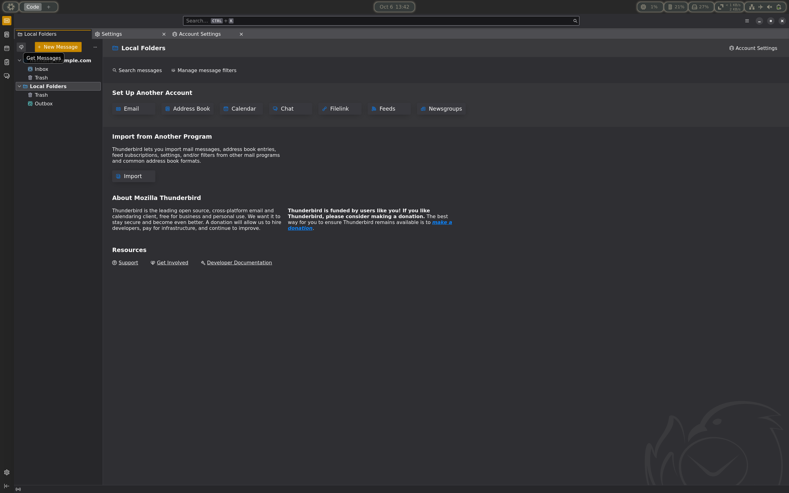

# TP2_CPP_CS_3A

## Use the project 

### Quick start - CLI

1. Launch the binary (make sur it is executable)
```bash
./pop3-server
```
2. Connect to the server 
```bash
nc localhost 9999
```
3. Use normally the server !


## Mail client - Thunderbird

0. You first need to install Thunderbird on your machine

1. When launching Thunderbird you need to click on the top right corner on `Account Settings`


2. Here you are going to setup a new account `+ New Account` then `Mail Account...` 


3. New you will need to setup the email address copy the same value as the screenshot.

After filling the value, click on `Configure manually`

After filling the value, click on `Advanced config`


4. You now should have your account setup when you click back on Local Folders. Try to click on `Get Messages` to fetch messages from the server. 


5. You should now receive the messages loaded in the server !


## Development Setup

### Option 1: Using Nix

You can first enter a nix shell to obtain the same dev environment as the one used for the project
```bash
nix develop
```

Then you need to create the _C++ build files_ 
```bash
cmake -S . -B build
```

Finally to build the project, go to the root of the project:
```bash
cmake --build build
```

### Option 2: Manual Installation (Without Nix)

> [!CAUTION]
> We give the used version of each external dependency as an indication
> The project can be build using other version but may not work.
> For the **ASIO** library, the code was also tested with the version given for the lab (_1.30.2_).

**Prerequisites**:
- **ASIO**: The networking library _1.24.0_
- **CMake**: To build the project _3.31.7_
- **GNU Make**: To compile the project _4.4.1_
- **GCC**: To compile _14.3.0_

If you don't use Nix, you'll need to add the ASIO library.
Download ASIO from https://think-async.com/Asio/Download.html and extract it at the root of the project.
You should have a structure like this:

```
.
├── asio/
│   └── (ASIO library files)
├── asio.hpp
├── CMakeLists.txt
├── flake.lock
├── flake.nix
├── include/
│   ├── RequestFactory.h
│   ├── Request.h
│   ├── Response.h
│   └── Server.h
├── INSTALL.md
├── README.md
└── src/
    ├── main.cpp
    ├── Request.cpp
    ├── RequestFactory.cpp
    ├── Response.cpp
    └── Server.cpp
```

Then build the project:
```bash
cmake -S . -B build
cmake --build build
```

## Running the Server

Once built, you can run the server:
```bash
./bin/serveur-echo
```